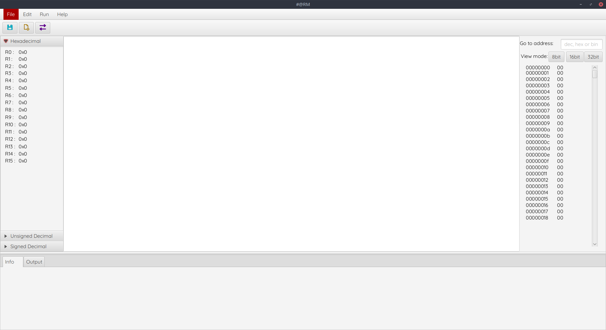
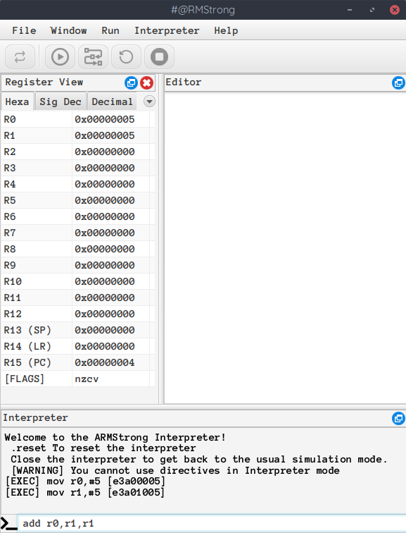
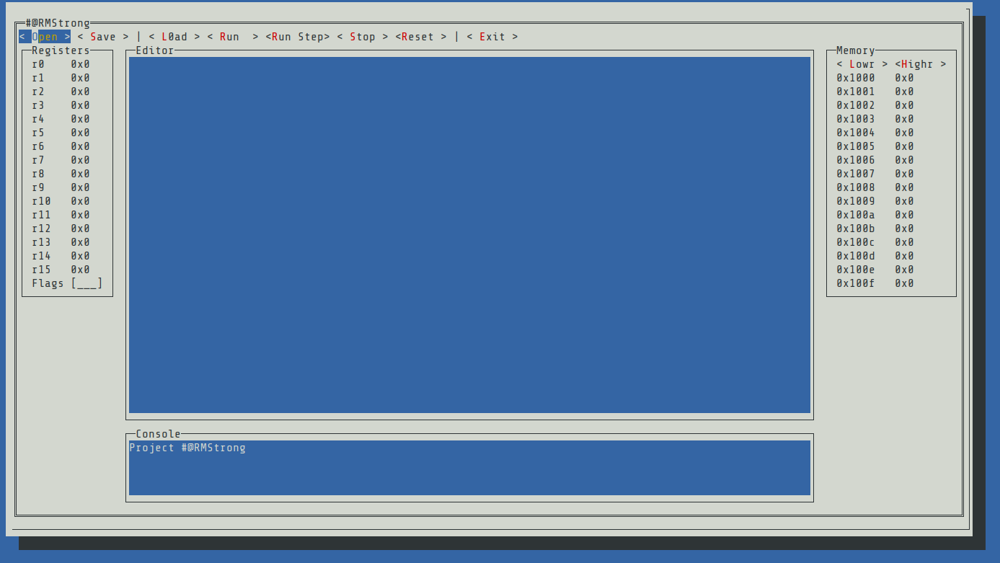
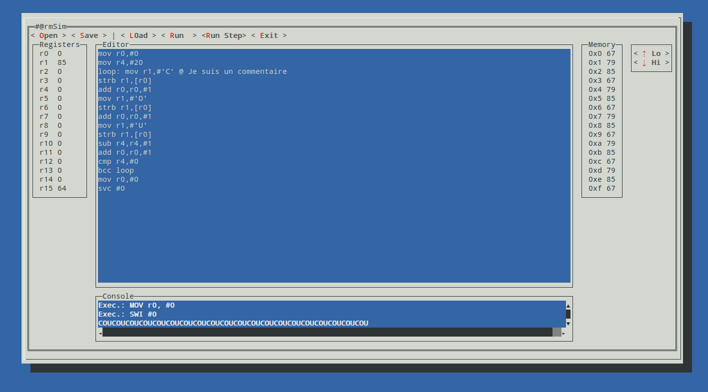

# 
## A fast and simple ARM Simulator made for education

## Installation

Download the [latest project-armstrong.jar](https://github.com/linouxis9/ARMStrong/releases/latest) and enjoy!

## Graphical User Interface


```bash
java -jar project-armstrong.jar
```

## Command-line Interface


```
java -jar project-armstrong.jar cli
```

## Information

### Requirements
- Java 11
- Windows x86/x64 or Linux x64

### Libraries used
- Unicorn
- Keystone
- JavaFX
- DockFX

> Made with :heart: by the #@RMStrong Team
