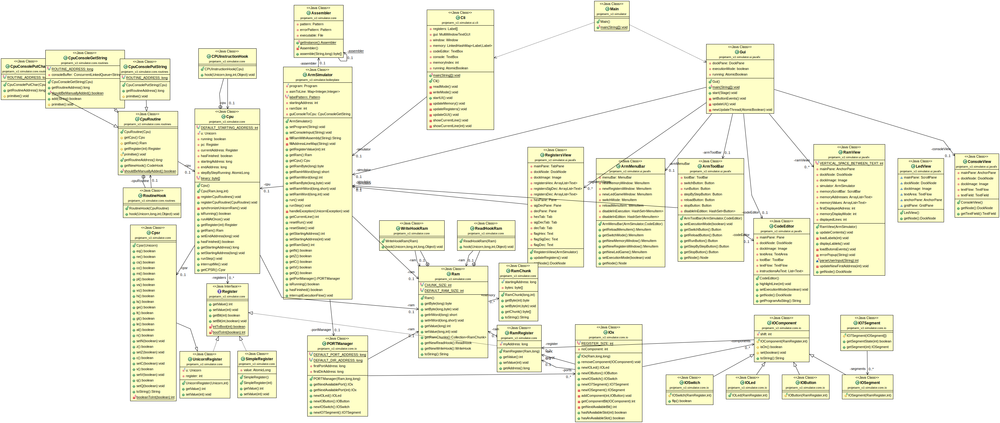

# 

## A fast and simple ARM Simulator made for education

[The Javadoc is available here](http://projectarm.devling.net/api/)

### The first version of our project has been released!
You can now try the JAR of our project!

[ProjectARM.jar](https://github.com/linouxis9/ProjectARM/releases/download/v1.0.0/ProjectARM.jar)

> Outdated Screenshots:

> 
> 
> 
> 

***

### Diagramme de classes
> 

> Made with :heart: by the #@RMStrong Team